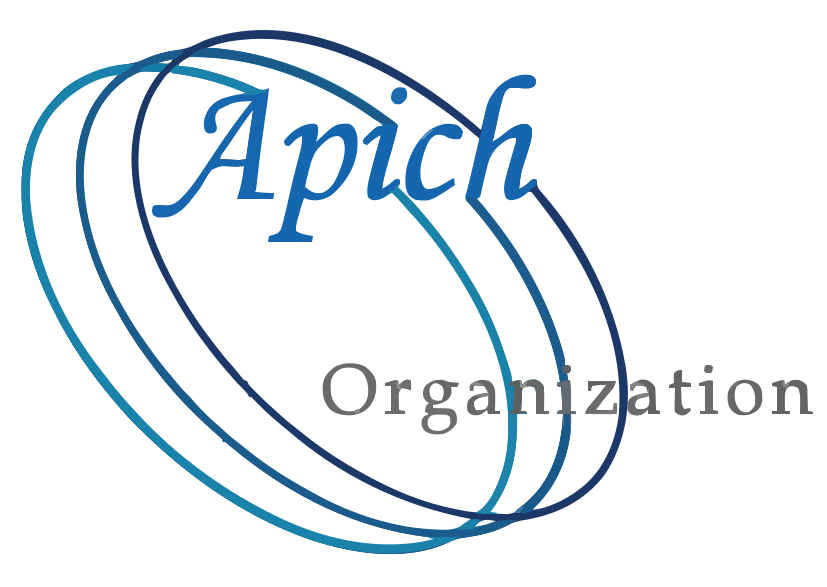

# OLLVM-Next (Ensia)



[](https://www.gnu.org/licenses/agpl-3.0)
[](https://doi.org/10.5281/zenodo.20149843)
[](https://discord.gg/D5e2czMTT9)
[](https://github.com/Apich-Organization/dtact/)

**⚠️ ETHICAL USE WARNING:** This is a high-strength obfuscation tool. Please read our [Ethics & Disclaimer Notice](./ETHICS.md) before use.

OLLVM-Next (Ensia) is an LLVM-based obfuscator. It is a derivative work, continuing the lineage of the [Hikari](https://github.com/HikariObfuscator/Hikari/), [Hikari-LLVM15](https://github.com/NeHyci/Hikari-LLVM15/), and [Hikari-LLVM19](https://github.com/PPKunOfficial/Hikari-LLVM19/) projects.  
This project aims to provide a functional tool for protecting code on modern LLVM toolchains (versions 21 and 22). It is not meant to be "perfect," but it tries to make the reverse-engineering process more time-consuming.

## **Core Philosophy**

Traditional **VM-based obfuscators (Virtualizers)** wrap bytecode inside a custom interpreter runtime. While hard to reverse manually, they introduce a **high Single Point of Failure (SPOF) risk**: once an analyst or automated tool devirtualizes the core handler table or dispatches the central VM loop, the entire protection collapses at once.

**Ensia abandons the single-point interpreter architecture.** Instead, it enforces **SMT Symbolic Solver State-Space Explosion** through a composition of distributed passes:
* **Vector-Space Lifting (SIMD):** Lifts scalar logic into multi-lane SIMD vector operations, defeating scalar symbolic execution engines.
* **Interleaved Data & Control Flow:** Interlocks data flow passes (MBA, String/Constant Encryption) with control flow transforms (Chaos State Machine, Control Flow Flattening).
* **Multi-Layer MBA & Hardware Predicates:** Injects multi-term Mixed Boolean-Arithmetic expressions and hardware-bound non-patchable opaque predicates (CPUID, RDTSC/CNTVCT), forcing SMT solvers (like Z3/Angr/KLEE) into exponential path and expression explosion.

## **Current Status**

* **Core:** Updated to work with the latest LLVM internal APIs.  
* **Logic:** Uses a specific pass order to ensure different layers of obfuscation build on top of each other without breaking the code.  
* **Intensity:** Offers presets to balance between protection strength and the resulting binary size/speed.

## **Obfuscation Pipeline**

The tool runs passes in a deliberate order to ensure stability. Here is a simplified look at what happens:

1. **Environment Checks:** Includes basic checks for debuggers, hooks, and metadata dumping.  
2. **Data Hiding:** Encrypts strings and constants using different methods (XOR, GF8, Feistel).  
3. **Control Flow:**  
   * **Chaos State Machine (CSM):** Uses a logistic-map to flatten code. This is the strongest mode.  
   * **Flattening:** A fallback for functions that the CSM cannot handle.  
4. **Instruction Complexity:** Uses Substitution and Mixed Boolean-Arithmetic (MBA) to make simple math look complicated.  
5. **Vectorization:** Lifts scalar code into SIMD vectors to confuse analysis tools.  
6. **Cleanup:** Strips debug information and renames internal symbols to hide their purpose.

## **How to Use**

You can use the obfuscator by passing flags or configuration files to the LLVM compiler:

* `-mllvm -ensia`: Enable the obfuscation master scheduler.
* `-mllvm -ensia-preset=<low|mid|high|max>`: Choose an obfuscation profile (`low`, `mid`, `high`, or `max`).
* `-mllvm -ensia-config=ensia.toml`: Pass a structured TOML configuration file for module/function-level fine-grained policy control.
* `-mllvm -enable-medobf`: Production-ready medium setting (Sub+MBA+ConstEnc+StrEnc+Flatten).
* `-mllvm -enable-maxobf`: Enables all 15 passes at extreme parameters (red-team / stress testing mode).

### **Environment Variables**

You can also enable or tune features via environment variables:

* `ENSIA=1` (Enable master scheduler)
* `ENSIA_PRESET=low|mid|high|max|csm_vec` (Set active profile)
* `ENSIA_CONFIG=/path/to/ensia.toml` (Set TOML configuration file)
* `STRCRY=1` (String Encryption)
* `CSMOBF=1` (Chaos State Machine)
* `MBAOBF=1` (Mixed Boolean-Arithmetic Math)
* `BCF_PROB=80`, `MBA_LAYERS=3`, `CONSTENC_FEISTEL=1`, `AH_DIRECT_SYSCALL=1` (Fine-grained pass parameters)

---

## **Rust Language Support (`cargo` / `rustc`)**

Ensia supports seamless integration with the Rust toolchain via LLVM pass plugins (`libEnsia_rust.so` / `Ensia_rust.dll`), enabling native obfuscation for Cargo packages and binary crates without modifying Rust source code.

### 1. Build the Rust Pass Plugin
When building Ensia, CMake automatically detects your active `rustc` LLVM version and builds the target `EnsiaRust`:

```bash
mkdir -p build && cd build
cmake .. -DCMAKE_BUILD_TYPE=Release
cmake --build . --target EnsiaRust --parallel $(nproc)
```

This generates `build/obfuscation/libEnsia_rust.so` (or `Ensia_rust.dll` on Windows).

### 2. Compile & Test with Cargo
Pass the plugin and active profile via `RUSTFLAGS` and environment variables:

```bash
# Build binary or library with Ensia (csm_vec profile)
ENSIA_PRESET=csm_vec RUSTC_BOOTSTRAP=1 \
RUSTFLAGS="-Z llvm-plugins=$(pwd)/build/obfuscation/libEnsia_rust.so -C passes=ensia" \
cargo build --release

# Run unit tests through obfuscated LLVM IR
ENSIA_PRESET=csm_vec RUSTC_BOOTSTRAP=1 \
RUSTFLAGS="-Z llvm-plugins=$(pwd)/build/obfuscation/libEnsia_rust.so -C passes=ensia" \
cargo test --lib --tests
```

### 3. Automated Project Test Runner
A test runner script is provided at [`scripts/test_rust_projects.sh`](./scripts/test_rust_projects.sh) for batch validation across projects (e.g. `bincode`, `dtact`):

```bash
./scripts/test_rust_projects.sh csm_vec
```

---

## **Windows Platform Compatibility**

Ensia is architecturally designed with cross-platform support for **Windows (x86_64, ARM64, and i386)** using MSVC, `clang-cl`, or MinGW:

### 1. Dynamic Linking & PE/COFF Symbol Resolution
Unlike ELF on Linux where plugins can leave host symbols unresolved until runtime, Windows PE/COFF dynamic libraries (`.dll`) require all symbols to be resolved at link time. Ensia handles this via:
- **Automatic LLVM Component Mapping**: CMake maps and links `${llvm_libs}` (`LLVMCore`, `LLVMSupport`, `LLVMPasses`, etc.) when `WIN32` is defined.
- **Export Table Attributes**: The plugin entry point `llvmGetPassPluginInfo` is decorated with `__declspec(dllexport)` on `_WIN32` builds.
- **MinGW Static Runtime Support**: Automatically static-links `winpthread`, `libgcc`, and `libstdc++` to eliminate runtime DLL missing dependencies.

### 2. Cross-Platform Entropy & Process APIs
- Replaces POSIX `getpid()` with `_getpid()` from `<process.h>`.
- Replaces POSIX timer hooks on Windows with high-resolution `QueryPerformanceCounter` (QPC) and `GetTickCount64()`.
- Windows ARM64 hardware entropy taps into `PF_ARM_V8_CRYPTO_INSTRUCTIONS_AVAILABLE` for non-faulting random generation.

### 3. Building on Windows (MSVC / clang-cl / MinGW)

```cmd
:: Using CMake with Ninja & Clang-cl / MSVC
mkdir build && cd build
cmake .. -G Ninja -DCMAKE_BUILD_TYPE=Release -DLLVM_DIR="C:/path/to/llvm/lib/cmake/llvm"
ninja Ensia
```

To use with `clang-cl`:
```cmd
clang-cl /fpass-plugin=build/obfuscation/Ensia.dll -mllvm -ensia -mllvm -ensia-preset=csm_vec main.c
```

## **Important Warnings**

* **Dual-Use:** Please read the [ETHICS.md](./ETHICS.md) file and the the [ETHICS.pdf](./ETHICS.pdf) file. This tool is for protecting your own work or for research.  
* **Stability:** Obfuscation can sometimes introduce bugs or performance issues. Always test your software thoroughly after building it with these flags.  
* **Bloat:** Using "Max Mode" can increase binary size significantly.

## **Licensing & Attribution**

This project is licensed under the **AGPL-3.0**. It includes code and logic from the Hikari and LLVM projects. See [LEGAL.md](./LEGAL.md) for full details on project history and original authors.

## Sponsorship & Funding Policy

We welcome sponsorships from individuals and organizations supporting open-source compiler security research. Please review our [Sponsorship Policy](./sponsor.md) for details on fund allocation, contribution options via Open Collective, corporate tiers, and our strict anti-money laundering policies.

* **Open Collective Link:** [https://opencollective.com/apich-organization](https://opencollective.com/apich-organization)

## Code of Conduct & Security

Please read the [CODE_OF_CONDUCT.md](./CODE_OF_CONDUCT.md) and [SECURITY.md](./SECURITY.md) files for more details.